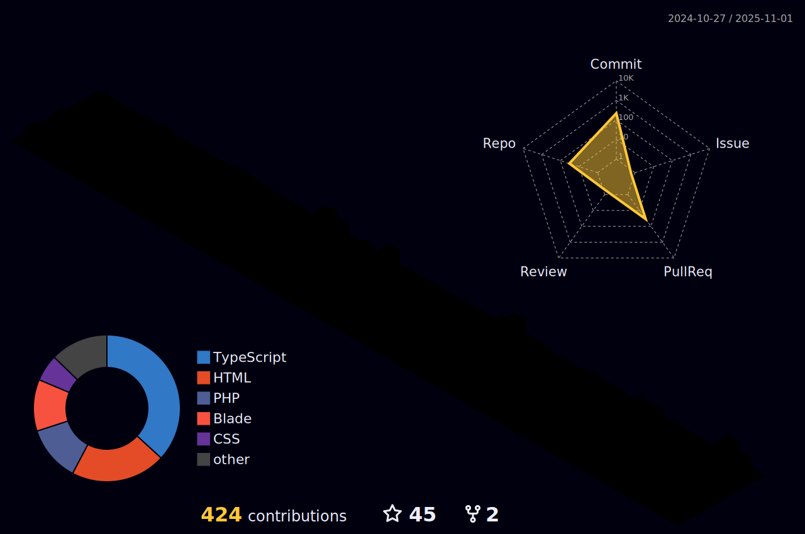

  

  
  
  
  

### 🧠 Who Am I?

👨🏻‍💻 I’m a Junior Web Developer and an undergraduate student, passionate about crafting modern web experiences with clean code and thoughtful design ✨.

I see every project as an opportunity to grow and to bring ideas into impactful digital products. Beyond coding, I value collaboration, continuous learning, and sharing knowledge ⚡. My journey is about building not just software, but a meaningful career in tech 🚀.

---

### 🧰 Tech & Tools I use

  <!-- Languages -->
  
  
  
  
  
  
   
   

  <!-- Frameworks & Libraries -->
  
  
  
  
  
  
  
  
  
  
  
  
  
   
   

  <!-- Database & ORM -->
  
  
  
  
  
  
  
  
  

  <!-- Deployment & Package Manager -->
  
  
  
  
  

  <!-- Tools -->
  
  
  

---

### 📊 GitHub Stats

  

<!-- 

  

<table align="center">
<tr>
  <td></td>
  <td></td>
</tr>
<tr>
  <td></td>
  <td></td>
</tr>
</table> -->

  

